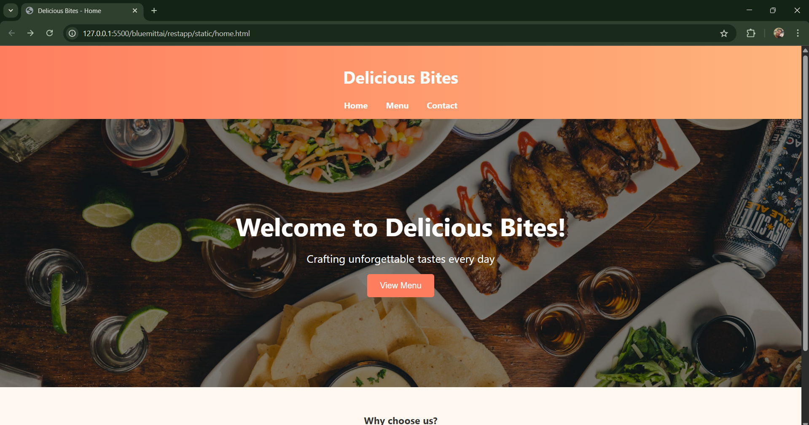
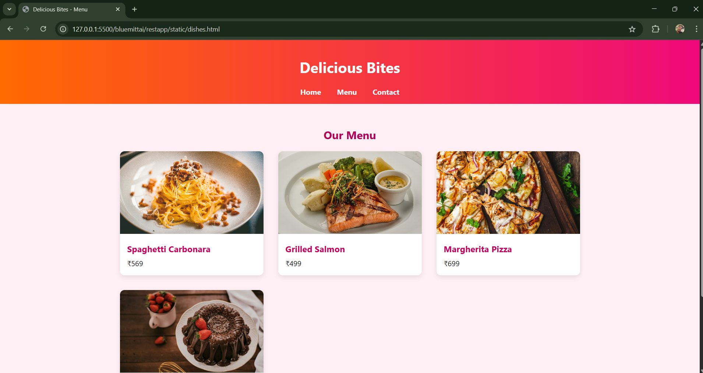
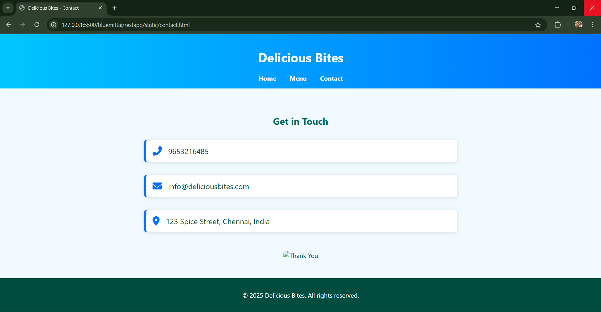

# Ex.07 Restaurant Website
## Date: 15/05/2025

## AIM:
To develop a static Restaurant website to display the food items and services provided by them.

## DESIGN STEPS:

### Step 1:
Requirement collection.

### Step 2:
Creating the layout using HTML and CSS.

### Step 3:
Updating the sample content.

### Step 4:
Choose the appropriate style and color scheme.

### Step 5:
Validate the layout in various browsers.

### Step 6:
Validate the HTML code.

### Step 7:
Publish the website in the given URL.

## PROGRAM:
Home.html
```html
<!DOCTYPE html>
<html lang="en">
<head>
    <meta charset="UTF-8">
    <title>Delicious Bites - Menu</title>
    <style>
        body {
            font-family: 'Segoe UI', sans-serif;
            margin: 0;
            background: #fff0f5;
            color: #222;
        }
        header {
            background: linear-gradient(90deg, #ff6a00, #ee0979);
            color: white;
            padding: 1rem;
            text-align: center;
        }
        nav a {
            margin: 0 15px;
            color: white;
            text-decoration: none;
            font-weight: bold;
        }
        nav a:hover {
            text-decoration: underline;
        }
        main {
            padding: 2rem;
        }
        h2 {
            text-align: center;
            color: #b30059;
        }
        .menu-grid {
            display: grid;
            grid-template-columns: repeat(auto-fit, minmax(250px, 1fr));
            gap: 2rem;
            max-width: 1000px;
            margin: auto;
        }
        .dish-card {
            background: white;
            border-radius: 10px;
            box-shadow: 0 4px 10px rgba(0,0,0,0.1);
            overflow: hidden;
            transition: transform 0.2s;
        }
        .dish-card:hover {
            transform: scale(1.03);
        }
        .dish-card img {
            width: 100%;
            height: 180px;
            object-fit: cover;
        }
        .dish-info {
            padding: 1rem;
        }
        .dish-info h3 {
            margin: 0 0 0.5rem 0;
            color: #cc005f;
        }
        .dish-info p {
            margin: 0;
        }
        footer {
            background: #222;
            color: white;
            text-align: center;
            padding: 1rem;
        }
    </style>
</head>
<body>
    <header>
        <h1>Delicious Bites</h1>
        <nav>
            <a href="home.html">Home</a>
            <a href="dishes.html">Menu</a>
            <a href="contact.html">Contact</a>
        </nav>
    </header>
    <main>
        <h2>Our Menu</h2>
        <div class="menu-grid">
            <div class="dish-card">
                
                <div class="dish-info">
                    <h3>Spaghetti Carbonara</h3>
                    <p>₹569</p>
                </div>
            </div>
            <div class="dish-card">
                
                <div class="dish-info">
                    <h3>Grilled Salmon</h3>
                    <p>₹499</p>
                </div>
            </div>
            <div class="dish-card">
                
                <div class="dish-info">
                    <h3>Margherita Pizza</h3>
                    <p>₹699</p>
                </div>
            </div>
            <div class="dish-card">
                
                <div class="dish-info">
                    <h3>Chocolate Lava Cake</h3>
                    <p>₹299</p>
                </div>
            </div>
        </div>
    </main>
    <footer>
        <p>&copy; 2025 Delicious Bites. All rights reserved.</p>
    </footer>
</body>
</html>
```
dishes.html
```html
<!DOCTYPE html>
<html lang="en">
<head>
    <meta charset="UTF-8">
    <title>Delicious Bites - Menu</title>
    <style>
        body {
            font-family: 'Segoe UI', sans-serif;
            margin: 0;
            background: #fff0f5;
            color: #222;
        }
        header {
            background: linear-gradient(90deg, #ff6a00, #ee0979);
            color: white;
            padding: 1rem;
            text-align: center;
        }
        nav a {
            margin: 0 15px;
            color: white;
            text-decoration: none;
            font-weight: bold;
        }
        nav a:hover {
            text-decoration: underline;
        }
        main {
            padding: 2rem;
        }
        h2 {
            text-align: center;
            color: #b30059;
        }
        .menu-grid {
            display: grid;
            grid-template-columns: repeat(auto-fit, minmax(250px, 1fr));
            gap: 2rem;
            max-width: 1000px;
            margin: auto;
        }
        .dish-card {
            background: white;
            border-radius: 10px;
            box-shadow: 0 4px 10px rgba(0,0,0,0.1);
            overflow: hidden;
            transition: transform 0.2s;
        }
        .dish-card:hover {
            transform: scale(1.03);
        }
        .dish-card img {
            width: 100%;
            height: 180px;
            object-fit: cover;
        }
        .dish-info {
            padding: 1rem;
        }
        .dish-info h3 {
            margin: 0 0 0.5rem 0;
            color: #cc005f;
        }
        .dish-info p {
            margin: 0;
        }
        footer {
            background: #222;
            color: white;
            text-align: center;
            padding: 1rem;
        }
    </style>
</head>
<body>
    <header>
        <h1>Delicious Bites</h1>
        <nav>
            <a href="home.html">Home</a>
            <a href="dishes.html">Menu</a>
            <a href="contact.html">Contact</a>
        </nav>
    </header>
    <main>
        <h2>Our Menu</h2>
        <div class="menu-grid">
            <div class="dish-card">
                
                <div class="dish-info">
                    <h3>Spaghetti Carbonara</h3>
                    <p>₹569</p>
                </div>
            </div>
            <div class="dish-card">
                
                <div class="dish-info">
                    <h3>Grilled Salmon</h3>
                    <p>₹499</p>
                </div>
            </div>
            <div class="dish-card">
                
                <div class="dish-info">
                    <h3>Margherita Pizza</h3>
                    <p>₹699</p>
                </div>
            </div>
            <div class="dish-card">
                
                <div class="dish-info">
                    <h3>Chocolate Lava Cake</h3>
                    <p>₹299</p>
                </div>
            </div>
        </div>
    </main>
    <footer>
        <p>&copy; 2025 Delicious Bites. All rights reserved.</p>
    </footer>
</body>
</html>
```
contact.html
```html
<!DOCTYPE html>
<html lang="en">
<head>
    <meta charset="UTF-8">
    <title>Delicious Bites - Contact</title>
    <link rel="stylesheet" href="https://cdnjs.cloudflare.com/ajax/libs/font-awesome/6.5.0/css/all.min.css">
    <style>
        body {
            font-family: 'Segoe UI', sans-serif;
            margin: 0;
            background: #f0faff;
            color: #004d40;
        }
        header {
            background: linear-gradient(90deg, #00c6ff, #0072ff);
            color: white;
            padding: 1rem;
            text-align: center;
        }
        nav a {
            margin: 0 15px;
            color: white;
            text-decoration: none;
            font-weight: bold;
        }
        nav a:hover {
            text-decoration: underline;
        }
        main {
            padding: 3rem 2rem;
            max-width: 800px;
            margin: auto;
        }
        h2 {
            text-align: center;
            color: #00695c;
        }
        .contact-box {
            display: flex;
            flex-direction: column;
            gap: 2rem;
            margin-top: 2rem;
        }
        .contact-item {
            display: flex;
            align-items: center;
            gap: 1rem;
            font-size: 1.2rem;
            background: white;
            padding: 1rem;
            border-left: 6px solid #0072ff;
            border-radius: 8px;
            box-shadow: 0 2px 10px rgba(0,0,0,0.1);
        }
        .contact-item i {
            font-size: 1.5rem;
            color: #0072ff;
        }
        .thank-you-graphic {
            margin-top: 3rem;
            text-align: center;
        }
        .thank-you-graphic img {
            width: 250px;
            border-radius: 10px;
        }
        footer {
            background: #004d40;
            color: white;
            text-align: center;
            padding: 1rem;
        }
    </style>
</head>
<body>
    <header>
        <h1>Delicious Bites</h1>
        <nav>
            <a href="home.html">Home</a>
            <a href="dishes.html">Menu</a>
            <a href="contact.html">Contact</a>
        </nav>
    </header>
    <main>
        <h2>Get in Touch</h2>
        <div class="contact-box">
            <div class="contact-item">
                <i class="fas fa-phone-alt"></i>
                <span>9653216485</span>
            </div>
            <div class="contact-item">
                <i class="fas fa-envelope"></i>
                <span>info@deliciousbites.com</span>
            </div>
            <div class="contact-item">
                <i class="fas fa-map-marker-alt"></i>
                <span>123 Spice Street, Chennai, India</span>
            </div>
        </div>
        <div class="thank-you-graphic">
            
        </div>
    </main>
    <footer>
        <p>&copy; 2025 Delicious Bites. All rights reserved.</p>
    </footer>
</body>
</html>
```

## OUTPUT:



## RESULT:
The program for designing software company website using HTML and CSS is completed successfully.
